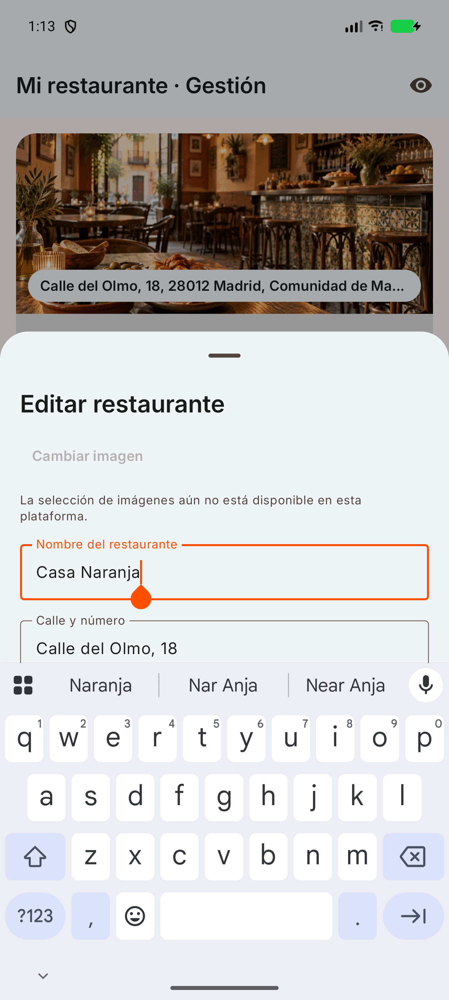
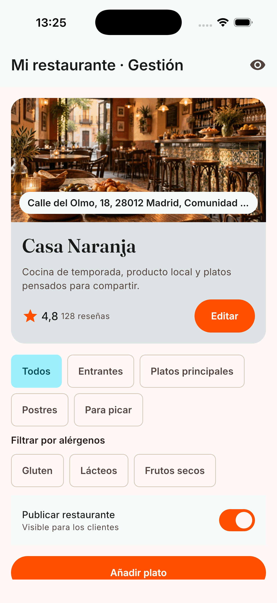

# Restaurant Home screenshots

Android captures were taken from the debug build on a Pixel 10 Pro XL emulator. The final capture
was taken from the same Compose screen running in the iOS debug build on an iPhone 17 Pro Simulator.

| Management | Customer preview |
| --- | --- |
|  |  |

| Edit restaurant | Add dish |
| --- | --- |
|  |  |

| Keyboard and IME padding |
| --- |
|  |

| iOS management capture |
| --- |
|  |
