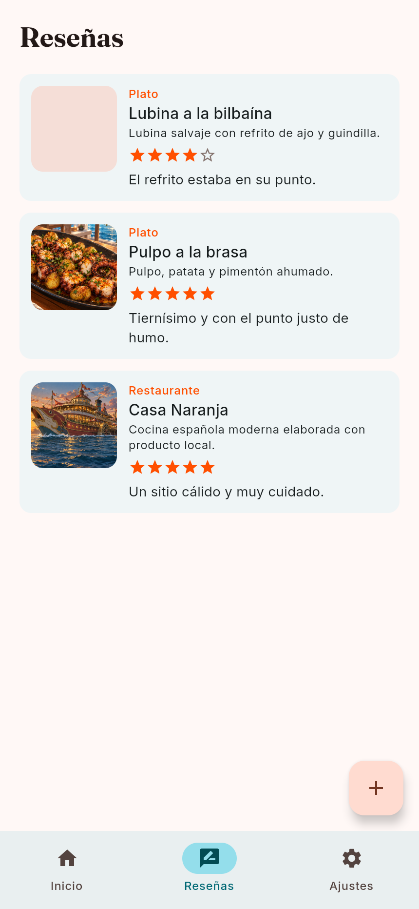
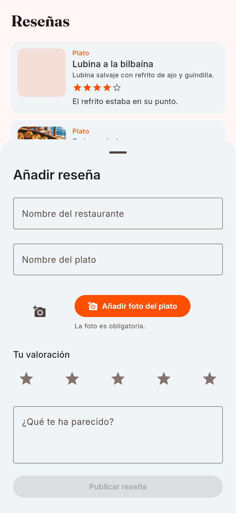
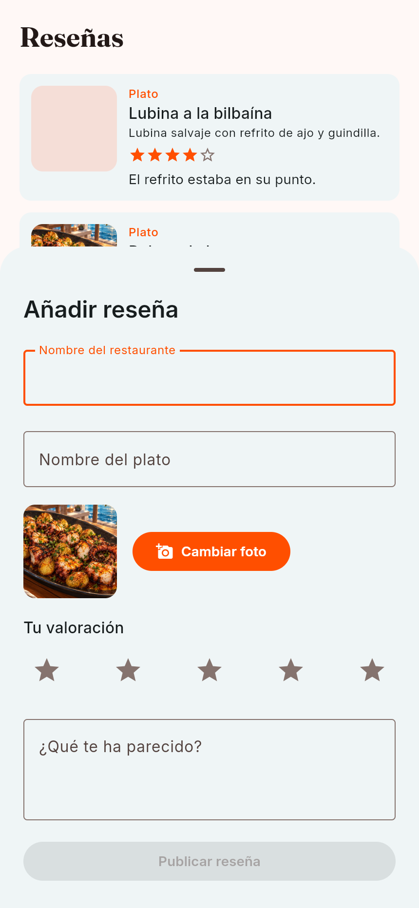

# Reviews: reseñas de restaurantes sin carta publicada

Capturas reales de la aplicación Compose/Wasm ejecutada en Chromium, en español y
tema claro, con viewport de 430 × 932 CSS px y escala de pantalla 2×.

Se usaron los repositorios de demostración existentes (`initKoin(useFakeData = true)`)
y una cuenta ficticia. Las imágenes de los fixtures se resolvieron con assets locales.
No se crearon cuentas ni reseñas en staging o producción. El ajuste de arranque para
las capturas fue temporal y se restauró antes del commit; el código funcional de la
feature permanece intacto.

| Reviews y FAB | Formulario de nueva reseña | Foto seleccionada |
| --- | --- | --- |
|  |  |  |

Estas capturas documentan la interfaz web en tamaño compacto. No representan una
captura de Android/iOS ni acreditan publicación contra el backend remoto.
